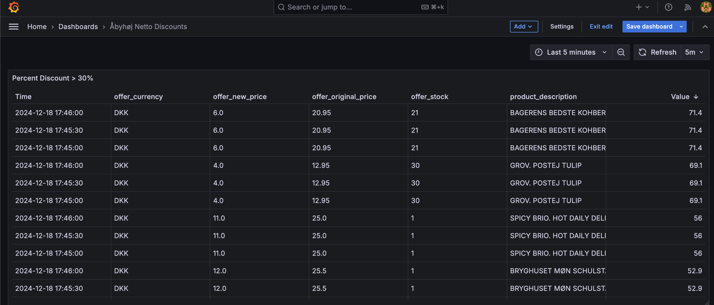

# Salling Group Food Waste Prometheus Exporter
A Prometheus Exporter that exports Salling Group Food Waste clearances as gauge metrics.

I created this for a bit hacky discount monitoring setup where I use Prometheus Alert Manager to send me alerts regarding food discounts in the store near me.



# Published Metrics
The exporter publishes a metric for each `Clearance` for each `FoodWaste` returned from each `/v1/food-waste?zip=<ZIP>` API call.

TODO: Split into multiple metrics instead of just bunching everything together in the labels
Metrics: 
- `salling_group_food_waste_percent_discount`
- `salling_group_food_waste_percent_new_price`
- `salling_group_food_waste_percent_discount`

## Examples
```
salling_group_food_waste_percent_discount{container="salling-foodwaste-prometheus-exporter",endpoint="8080",instance="10.103.88.168:8080",job="salling-foodwaste-prometheus-exporter",namespace="monitoring",offer_currency="DKK",offer_ean="5712580368382",offer_end_time="2024-12-19T22:59:59.000Z",offer_original_price="16.0",offer_start_time="2024-12-16T12:16:40.000Z",offer_stock="1",offer_stock_unit="each",pod="salling-foodwaste-prometheus-exporter-cc5bd5fbd-tbq5g",product_description="ØKO SKUMMETMÆLK LØGISMOSE",product_ean="5710328002864",service="salling-foodwaste-prometheus-exporter",store_address_city="Åbyhøj",store_address_country="DK",store_address_street="Silkeborgvej 246",store_address_zip="8230",store_brand="netto",store_id="67766b50-4cc6-4658-8fc4-a9b2db468f91",store_name="Netto Åbyhøj, Silkeborgvej"}
salling_group_food_waste_new_price{container="salling-foodwaste-prometheus-exporter",endpoint="8080",instance="10.103.88.168:8080",job="salling-foodwaste-prometheus-exporter",namespace="monitoring",offer_currency="DKK",offer_ean="5712580363066",offer_end_time="2024-12-28T22:59:59.000Z",offer_original_price="109.0",offer_start_time="2024-12-11T06:27:35.000Z",offer_stock="1",offer_stock_unit="each",pod="salling-foodwaste-prometheus-exporter-cc5bd5fbd-tbq5g",product_description="GULD 45+ MAMMEN",product_ean="5703985055052",service="salling-foodwaste-prometheus-exporter",store_address_city="Åbyhøj",store_address_country="DK",store_address_street="Silkeborgvej 246",store_address_zip="8230",store_brand="netto",store_id="67766b50-4cc6-4658-8fc4-a9b2db468f91",store_name="Netto Åbyhøj, Silkeborgvej"}
salling_group_food_waste_discount{container="salling-foodwaste-prometheus-exporter",endpoint="8080",instance="10.103.88.168:8080",job="salling-foodwaste-prometheus-exporter",namespace="monitoring",offer_currency="DKK",offer_ean="5712580363066",offer_end_time="2024-12-28T22:59:59.000Z",offer_original_price="109.0",offer_start_time="2024-12-11T06:27:35.000Z",offer_stock="1",offer_stock_unit="each",pod="salling-foodwaste-prometheus-exporter-cc5bd5fbd-tbq5g",product_description="GULD 45+ MAMMEN",product_ean="5703985055052",service="salling-foodwaste-prometheus-exporter",store_address_city="Åbyhøj",store_address_country="DK",store_address_street="Silkeborgvej 246",store_address_zip="8230",store_brand="netto",store_id="67766b50-4cc6-4658-8fc4-a9b2db468f91",store_name="Netto Åbyhøj, Silkeborgvej"}
```

# Deployment
## Helm Chart 
TODO: Add helm chart

# Configuration
## API Key
This exporter requires a Salling Group API key that has `/v1/food-waste/**` scope.
The API key can be set through the `FW_EXPORTER_API_KEY` environment variable.
```
export FW_EXPORTER_API_KEY=<YOUR_API_KEY>
```

## Zip Codes
To configure which zip codes to get metrics form, set the `FW_EXPORTER_ZIP_CODES` environment variable. 
Example: 
```
export FW_EXPORTER_ZIP_CODES='["8230"]'
```
The exporter invokes a GET `/v1/food-waste?zip=<ZIP>` for each zip code specified in the `FW_EXPORTER_ZIP_CODES` on each scrape. 

## Caching
The exporter caches the result of GET `/v1/food-waste?zip=<ZIP>` to prevent excessive API calls.
Cache invalidation can be configured using the `FW_EXPORTER_CACHE_INVALIDATION_THRESHOLD`, which configures how many minutes data for a given zip code should be cached.

